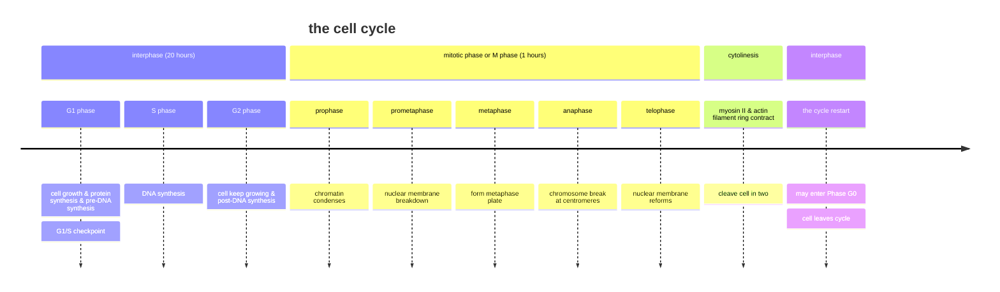
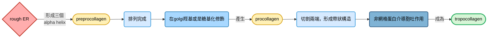
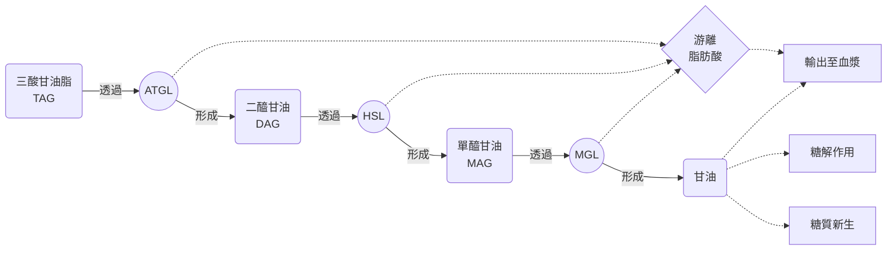
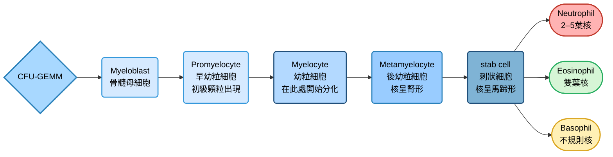
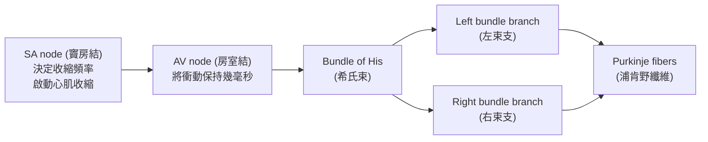
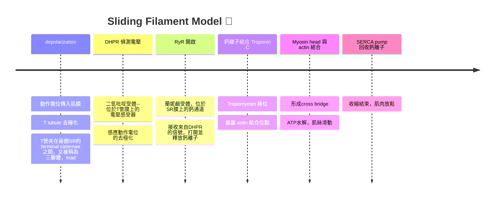
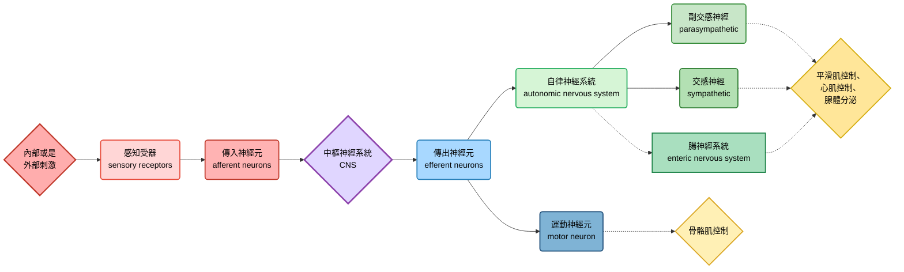
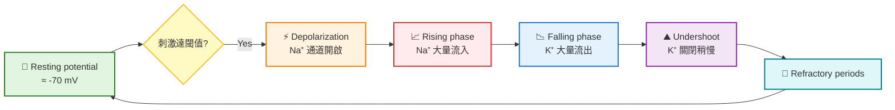

# histology note
### before we start the class...
#### resolution
- 解析度: 還能夠區分兩個物體時，兩個物體的最小距離
- 解析度公式如下: 

$$d=\frac{0.612\lambda}{NA\cdot \sin\alpha}$$

- 一旦物體太小，或是光線波長過長，光線容易散射，導致畫面模糊

#### microscopy

| 顯微鏡類型 | 作用機制 | 主要用途 |
| --- | --- | --- |
| **光學顯微鏡 (Bright-field microscope)** | 利用可見光透過樣本，經鏡片放大影像。需要染色才能看清楚細胞結構。 | 基礎組織學、細胞形態觀察。 |
| **相差顯微鏡 (Phase-contrast microscope)** | 利用光波經過不同折射率的結構時產生相位差，轉換成影像對比。 | 觀察未染色的活細胞、細胞器動態。 |
| **螢光顯微鏡 (Fluorescence microscope)** | 使用特定波長激發螢光染料或螢光蛋白，發射光被鏡頭捕捉。 | 標記特定蛋白、核酸或細胞結構。 |
| **共軛焦顯微鏡 (Confocal microscope)** | 利用雷射光逐點掃描，並用針孔來擋住其他發散的光，形成一點點清晰的影像，然後好多的點影像變成一個平面，很多個平面形成一個立體結構 | 三維結構成像、厚切片或組織的立體觀察。 |
| **電子顯微鏡 (Electron microscope)** | 利用電子束當光，電磁鐵當物鏡跟目鏡。電子聚焦到樣本上後反射，儀器偵測這些反射的電子，形成影像。SEM看表面，解析度低；TEM看內部，解析度高 | TEM：細胞超微結構 (如線粒體、核膜)。 SEM：表面形態 (如病毒外殼、細胞膜凹凸)。 |

👉 詳細備註在這

- 光學顯微鏡利用石蠟或是OCT，可以保留蛋白質構造
- EM的樣本通常嵌入還氧樹酯，樣品非常薄
- cryo-EM: 冷凍水合的樣本，再用電子顯微鏡，做出立體的蛋白質結構    

#### staining dye
- hematoxylin，讓細胞核變成藍色
- Carmine，讓細胞核變成紅色
- 酸性染劑，帶正電，可染光滑內質網、粒線體、細胞質 (紅色較多)
- 鹼性染料，帶負電，可染粗糙內質網、異染色質、細胞核 (藍色較多)
- 脂肪染料，例如oil red O、四氧化鋨
- HE stain: hematoxyline跟eosin一起用，根據構造不同產生不同顏色
  - hematoxyline是一種天然染料，來自於美洲蘇木，可以將細胞核染成藍紫色
  - eosin可以將組織變成粉色
- silver stain: 可用在對銀敏感的組織，例如網狀纖維
- PAS (periodic acid Schiff): 在結締組織中把醣類染成紅色

|oil red O|osmium tetroxide|HE stain|silver stain|PAS|
|---------|----------------|--------|------------|---|
||||||

> 讓我們開始吧 🐱

---

## the cell
- 內部包含membranous organelles，non-membranes organelles，跟cytoplasmic inclusions
### membrane
- 在將磷脂質分開時，外層 (outer leaflet) 被稱為E face (鑲嵌蛋白質較少)，內層 (inner leaflet) 被稱為P face (鑲嵌蛋白質較多)
#### membrane protein
- integral (有穿膜的蛋白) and peripheral (沒穿膜的蛋白)

#### 囊泡形成
- receptor mediated endocytosis: 會利用clathrin (網格蛋白)-associated
specific uptake，形成囊泡
- phagocytosis: 吞噬作用會朝對特定物質進行吞噬

👉 詳細備註在這

##### Constitutive secretion
- 構成型分泌，持續性、自動化的流程，細胞不需要特定外在信號，就可以自行產生胞吐作用
- 例如產生ECM (分泌膠原蛋白等等)，這是所有真核細胞都有的 "預設模式"，不需要使用網格蛋白
##### Regulated secretion
- 調節型分泌，通常會大量儲存在分泌型囊泡中，等到需要時 (例如某些細胞通路開啟)，才會爆發型釋放，而且需要網格蛋白形成囊泡
    

### nucleus
- **真染色質**會在細胞核中間的區域，**異染色質**會接近或是附著在核膜內側
- **perinuclear cistern**: 核內膜跟外膜之間的區域
- **nuclear pore complexes**: 負責幫忙把一些分子或是遺傳物質、RNA傳出或是傳入的區域。核孔複合體由五十多種蛋白質組成。大分子需要主動運輸才可通過

- **nuclear lamina**: 核纖層，覆蓋在內膜內側，作為穩定細胞核的工具，成分為intermediate filament
- **Barr body**: 巴爾小體，不活化的X染色體，屬於異染色質
- **nucleolus**: 核仁通常只有一個，除非你正在高速進行轉譯
- 轉錄時用的RNA polymerase: 

| RNA種類 | 主要功能 | 負責的RNA聚合酶 | 備註 |
| --- | --- | --- | --- |
| **mRNA** (messenger RNA) | 攜帶基因資訊，作為蛋白質合成模板 | **RNA polymerase II** | 也轉錄大部分的 snRNA、miRNA 等調控性RNA |
| **tRNA** (transfer RNA) | 將胺基酸帶到核糖體，對應mRNA密碼子 | **RNA polymerase III** | 同時也轉錄 5S rRNA 與一些小RNA |
| **rRNA** (ribosomal RNA) | 構成核糖體的主要結構與催化成分 | **RNA polymerase I** | 專門轉錄 28S、18S、5.8S rRNA；而 5S rRNA 例外由 RNA pol III 負責 |

- miRNA、lncRNA、piRNA在轉錄調節上扮演重要角色

#### cell cycle
- 分成G1, S, G2, and M (前三個被稱為interphase)
  - G1: 細胞增大，胞器增加
  - S: DNA複製、中心體複製
  - G2: 中心粒的複製已經完成，ATP的量足以進行細胞分裂
  - M: 分為 prophase、prometaphase、metaphase、anaphase、以及telophase

- 細胞週期由週期素 (cyclin) 跟週期素介導激酶 (cyclin dependent kinases) 反應

### endomembrane system
#### Endoplasmic reticulum
##### RER
- 為了跟核糖體以及信號辨識蛋白做反應，表面有ribophorins (核糖體結合蛋白) 跟docking proteins (對接蛋白)
- 功能為蛋白質的合成跟修飾，並包裝到囊泡裡面
> [!Note]
> 尼氏小體，是神經元細胞質中的顆粒狀構造，由RER跟多聚核糖體聚集而成，可以用甲苯胺藍或是結晶紫染色

##### SER
- 合成脂質，包含固醇類等等 (細胞膜的合成也是來自於它)
- 也是代謝藥物時的區域
- 平滑內質網旺盛的地方，例如: 
  - 肝臟細胞
  - 類固醇合成細胞，包含睪丸中的間質細胞 (分泌testosterone)，腎上腺皮質細胞 (分泌糖皮質素)，卵巢中的黃體 (分泌progesteroone)
- **sarcoplasmic reticulum**: 肌漿網，在去極化時釋放鈣離子

#### Golgi body
- 分成cis、medial、trans三個區域
- 中間區域有很多囊，囊又被稱為cisternae
- 反式區的構造更加複雜，涉及囊泡的運輸跟分配，又被稱為反式高基網路 (*trans*-Golgi network, TGN)
- 和轉譯後修飾、溶體的產生有關係
- 在不同囊中運輸囊泡時: 
  - COPII囊泡由內往外
  - COPI囊泡由外往內 

👉 詳細備註在這

##### vesicle種類
- **transfer vesicle**: 傳輸性囊泡，從RER被生成
- **condensing vesicles**: 儲存性囊泡，等待物質釋放指令
    
#### 標記方式
- **TPPase**，主要位於反式高基式體，作用就是水解TPP，常作為Golgi的組織化學標記
- **osmium tetroxide**，四氧化鋨，屬於cis Golgi的常見標記，其通常跟不飽和脂肪酸反映，這在cis-Golgi常見

#### endosome and lysosome
##### endosome
- 內體，屬於一個中間結構，跟吞噬作用以及溶體有關係
- 內體用質子幫浦增加自己的內部質子量，酸化內體內部，形成溶體
- 成熟方向從早期內體到晚期內體，然後為多泡體
- 內體酸化時的中間狀態，叫做多泡體，也就是**multivescular body (MVB)**
##### lysosome
- 溶體來自於網格蛋白介導的囊泡形成的晚期內體
- 溶體裡面由於質子幫浦，呈現酸性 (pH 5.0)
- 有不同種類，包含phagolysosomes (吞噬溶體) 跟autophagolysosomes (自噬溶體)

> [!Note]
> 溶體的膜以及酵素，都是在trans Golgi區域分配以及包裹好的。通常，如果高基氏體產生的囊泡裡面是溶體將來要使用的水解酶，該囊泡上面會標籤mannose-6-phosphate，促進該囊泡跟溶體融合

👉 詳細備註在這

##### 染色方式
- 利用**acid phosphatase**染成深色
- 是一種在酸性環境下作用的水解酵素，能分解磷酸單酯，釋放無機磷酸，位於溶體，可作為染色target

### mitochondria
- 有雙層膜 (outer and an inner membrane)，有膜間腔 (intermembrane space)，內膜的褶皺被稱為cristae，內膜包裹基質 (matrix)
- 來自 $\alpha$ -變形菌，利用二元分裂來複製，有環狀的DNA
- **不是內膜運輸系統的一部份**
- 透過氧化磷酸化形成ATP給細胞

👉 詳細備註在這

##### 染色方式
- 染色粒線體時會target細胞色素c氧化酶 (就是複合體IV啦 !!)

### Peroxisomes
- 不屬於內膜系統的一部份
- 裡面有各種酵素，例如: 
  - 尿酸氧化酶 (urate oxidase)，將尿酸氧化成allantoin，人類缺乏
  - D-AAO，分解胺基酸，產生alpha-keto acid、ammonia、過氧化氫
  - catalase，負責分解過氧化氫，形成水
- 可作為解毒的胞器
- 也能在脂肪酸合成時，幫忙延伸脂肪酸長度

👉 詳細備註在這

##### 染色方式
- 通常用過氧化物酶 (**Peroxidase**) 作為target染色

### ribosome
- 小型的，兩個亞基的，無膜狀的胞器，以單一亞基的形式存在 (只有在translation時才會兩個亞基結合)
- 兩個亞基根據離心沉降的情形，可以分成60S跟40S的部分
- 每個亞基都是由rRNA跟蛋白質組成
- 多聚核糖體 (polyribosomes): 很多個核糖體，利用單一的mRNA，合成很多個一樣的多肽

> [!Important]
> 他們不僅僅是合成蛋白質的工具，本身他們也有 "催化合成" 的功效 !! 🤔

### proteasomes
- 蛋白酶體，一共有兩種類型 (20S跟26S的)
- 20S的非主力，但不需要泛素化標記便可分解蛋白質，主要降解因為活性氧產生不正常羰基的蛋白質。
- 26S是主要的蛋白質降解角色，但是被降解的蛋白質需要先被泛素化

### centriole and cytoskeleton
- 中心粒由微管蛋白組成，在很多真核生物中都有出現，兩個中心粒形成一個中心體
- 主要功能就是在細胞分裂之前產生星狀體或是紡錘體
- 細胞骨架的功能:
  - 細胞或是胞器結構穩定
  - 物質運輸
  - 細胞運動
  - 細胞分裂

#### microtubules
- $\alpha$ 跟 $\beta$ -tubulin形成13條原絲纖維，最後捲成一條中空的微管，有plus and minus end

- 主要利用kinesis (往+端移動) 或是 dynein (往-端移動) 作為運輸蛋白，需要消耗ATP

##### 鞭毛或是運動纖毛構造
- 主體 (axoneme) 屬於9*2 + 2的排列構造
- 基底 (basal body) 屬於9*3 + 0的排列構造

    

#### actin filament
- 微絲主要作為細胞運動，形成偽足，以及微絨毛為主
- 也有plus and minus end

- 細肌絲就是由actin組成
  - 而所謂的粗肌絲，其實就是由作用在actin filament上的myosin II們組成的
  - actin filament上面由nebulin跟tropomyosin兩條繩子穩定結構，同時tropomyosin擋住了myosin II的結合位點
  - 等到鈣離子作用時，tropomyosin才會移開，暴露結合位點讓myosin II能夠作用

#### intermediate filament
- 中間絲 (IF) 會根據細胞的特化種類，由不同的蛋白質組成，例如: 
  - keratin主要出現在表皮細胞
  - vimentin主要出現在軟骨生成細胞、纖維母細胞、內皮細胞
  - desmin主要出現在肌肉纖維裡面
  - GFAP主要出現在星狀細胞、寡樹突細胞、許旺細胞、以及神經元裡面
  - lamin A, B, C主要構成細胞核的核纖層

### 細胞質成分
- 細胞質裡面往往有肝糖顆粒、脂滴、色素體等等

👉 詳細備註在這

##### lipofuscin
- 是細胞內的一種老化色素，簡單來說就是溶體消化胞器的渣梓，為氧化的脂質跟蛋白質的殘餘物，看起來是黃褐色的顆粒
- 本身就具有顏色，所以不需要額外染色，常見於心肌細胞、神經元、肝細胞等等，屬於老化的細胞特有的標誌
    
##### 組織切片中的特殊構造
- 酵素原顆粒 (**zymogen granules**)，裡面都是尚未活化的消化酵素，只有在特定激素作用下才會被釋放
- 腺泡 (**acini**)，位於分泌細胞中心的位置，通常酵素都是從這個地方分泌出去
- 杯狀細胞 (**goblet cells**)，內部的空腔 (**theca**)用來裝分泌物   

---

## Epithelium and Glands
- 組織分類可分為上皮、結締、肌肉、神經等等

### short introduction
#### 型態
- 上皮，三個胚層都有一部份形成了上皮組織
- 通常細胞外基質極少，甚至是沒有
- 有三種可能功能:
  - 形成身體的防護層 (皮膚)
  - 腸道的內部，幫助養分吸收
  - 分泌腺的細胞
- 上皮組織的功能包含保護、降低摩擦、營養吸收、分泌、排泄廢物、合成蛋白質或是酵素、接收感官訊號 (可以來自身體外或是身體內)、移動物體 (例如氣管壁纖毛，以及輸卵管的纖毛)
#### 跟其它組織的關係
- 表皮跟結締組織由基底膜分隔開來，上皮細胞透過半橋粒連節基底膜
通常基底膜又分成兩個部分:
  - 基底層 (basal lamina，較接近上皮，分為疏鬆基底層跟緻密基底層)
  - 網狀層 (reticular lamina，較接近結締組織)

### epithelium membrane
- 上皮組織並未有血管，其養分來源都是透過旁邊的結締組織擴散來的
- 不一定含有水分 (例如皮膚)，當然，所有腔室或是管壁基本上都含有水分 (例如體腔、消化道)
- 覆蓋漿液性體腔的膜被稱為間皮 (mesothelia)，而淋巴管跟血管壁上的被稱為內皮 (endothelia)
- 分類上根據形狀可以為squamous (flat)、cuboidal或是columnar
- 同時，單層細胞的上皮被稱為簡單上皮，有兩層或是兩層細胞以上的上皮被稱為複層上皮

### simple epithelium
- 所有簡單上皮細胞都有接觸到基底膜，這包含偽複層上皮
- 例如，微血管內皮屬於簡單鱗狀上皮

👉 詳細備註在這

#### 組織切片冷知識
##### 鱗狀跟立方上皮
- 簡單鱗狀上皮細胞的細胞核會在血管壁凸出來 🐱
- 如果細胞核沒有突出，細胞大小呈現圓型或是方形，為立方上皮
- 腎髓質可以同時看到簡單鱗狀上皮跟簡單立方上皮
    
##### 柱狀上皮
- 末端網狀結構 (terminal web)，負責固定微絨毛
- 刷毛緣 (brush border)，微絨毛結構
- 如果在柱狀上皮組織中看到詭異的圓形細胞核，它不屬於上皮組織，而是白血球遷移到此處形成的
    
##### 偽複層上皮
- 底層細胞，較小，但是依然有跟基底膜接觸
- 偽複層柱狀上皮組織可能有纖毛，其固定的基底也叫做terminal web

### stratified epithelium
#### stratified squamous epithelium
- 複層鱗狀上皮可以是角質化的 (keratinized)，沒有角質化的 (nonkeratinized)，或是部分角質化的 (parakeratinized)
- 屬於上皮組織中最厚重的一種，在功能上常常作為屏障。有時為了增加這種保護功能，這些細胞可能會在角質化後死亡

👉 詳細備註在這

    
#### 組織切片冷知識
##### squamous epithelium (nonkeratinized)
- 例如食道管壁
- 最底層的這種上皮細胞，其實形狀上更像是立方上皮細胞
- 這些上皮細胞從基底開始分裂生長，然後形狀變得越來越平滑，最後脫落
##### squamous epithelium (keratinized)
- 例如皮膚細胞
- 結締組織跟表皮組織之間的基底膜可能是不規則的，產生上皮脊 (表皮往內突出)、真皮脊 (結締組織往外突出)
- 基底膜因為真皮脊跟上皮脊的關係有了更大的表面積，有利於上皮組織營養的輸送
##### cuboidal epithelium
- 例如汗腺，橫切圖上的每一個有空腔的圓形都是汗腺的導管，可能還會看到微血管跟淋巴管 (有內皮細胞)

#### stratified columnar epithelium
- 可以被分成基底細胞層 (basal cell layer) 跟表細胞層 (superficial cell layer)

### transitional epithelium
- 移行上皮，細胞呈現圓頂狀
- 泌尿道的上皮組織就是這一種

### gland
- 如果該腺體 (上皮細胞) 所分泌的東西有管道運輸，那被稱為外分泌系統
- 如果分泌的東西沒有管道運輸，而是進入血液，那被稱為內分泌系統
- parenchyma，也就是 "腺體上負責分泌的細胞總稱"
- 外分泌腺可以根據其型態、導管分支的樣貌、其產生的分泌物為何來判斷
- 內分泌細胞可能排列成索狀、或是團狀，反正型態各異

#### 杯狀細胞
- 是唯一一個單細胞便形成了腺體分泌單位的組織，裡面膨大的組織被稱為theca
- theca跟杯狀細胞的細胞核 (通常看起來比較濃縮，比較扁) 之間可能有明顯的高基式體

#### 腺體的導管分支
- 無分支 (simple gland，例如腮腺、汗腺)
   - 汗腺的肌上皮細胞有許多分支突起，包圍汗腺導管，促進分泌物的排出
- 有分支 (compound gland，例如乳腺、胰腺)
   - 胰腺的每一個管泡 (acinus) 中間都有一個腔室，分泌細胞們排成圓形，酵素原從中心分泌
   - 酵素原顆粒在特殊情況才會分泌出酵素原

#### 分泌物性質
- 漿液腺 (分泌物呈現水狀，例如胰腺)
- 黏液腺 (例如小腸的布氏腺)
- 混合型 (舌下腺)
   - 唾腺根據分泌物型態，就會有不同型態的細胞。如同汗腺，這些唾腺都有肌上皮細胞促進液體排出
   - 舌下腺你可以看到兩種非常不一樣的細胞: 細胞核不明顯，染色後呈現白色泡狀，屬於黏液型。如果細胞核呈現圓形，非常明顯，染色後顏色較深，看起白比較厚實，就是漿液型

👉 詳細備註在這

    
##### 當你在看組織切片時
- 唾腺根據分泌物型態，就會有不同型態的細胞。如同汗腺，這些唾腺都有肌上皮細胞促進液體排出
- 舌下腺你可以看到兩種非常不一樣的細胞: 細胞核不明顯，染色後呈現白色泡狀，屬於黏液型。如果細胞核呈現圓形，非常明顯，染色後顏色較深，看起白比較厚實，就是漿液型
    

#### 分泌方式
- 局部分泌 (merocrine，只分泌腺細胞產生的物質，例如胰腺)
- 頂漿分泌 (apocrine，分泌出腺細胞產生的物質以及部分細胞質，例如乳腺)
- 全漿分泌 (holocrine，整個細胞死亡解體分泌出去，如皮脂腺)
   - 腺體通常腺體被結締組織囊 (capsules)包裹
   - 囊的周邊為小型的立方基底細胞，它們有再生能力
   - 而一旦老細胞被新生細胞 "擠" 到囊的中心，他們的細胞核就會退化，並且胞內累積脂肪，最後整個細胞死亡，形成分泌物
   - 汗腺通常就在皮脂腺旁邊

👉 詳細備註在這

  
##### 當你在看組織切片時
- 腺體通常腺體被結締組織囊 (capsules)包裹
- 囊的周邊為小型的立方基底細胞，它們有再生能力
- 而一旦老細胞被新生細胞 "擠" 到囊的中心，他們的細胞核就會退化，並且胞內累積脂肪，最後整個細胞死亡，形成分泌物
- 汗腺通常就在皮脂腺旁邊
    

### polarity
極性的話，三區的細胞表面型態大致如下:
- apical (鞭毛、纖毛、立體纖毛、微絨毛的生長區域)
- lateral (多數典型junction常常出現的地方)
- basal (透過半橋粒接觸基底層)

#### Apical Cell Membrane 分化構造
##### microvilli
- 微絨毛的主要填充物是actin filament，這些微絲在微絨毛頂端由villin蛋白固定
- 末端的固定網 (terminal web) 由中間絲跟微絲組成，terminal web的myosin II跟tropomyosin很多，能夠讓微絨毛 "分開一點"，而不是黏在一起
- fimbrin , espin , and fascin等，這些蛋白負責固定微絲跟微絲之間
- 鈣調蛋白跟myosin I也會協助actin固定在細胞膜上面
- 刷毛緣表面可能還有一層多糖 (glycocalyx)

##### cillia
- 每個微管二聚體由微管A (由13條原絲組成)以及微管B (僅由10條原絲組成) 結合
- 中間的 +2被彈性物質圍繞，周圍的九條二聚體都輻射狀的用彈性物質附著在中心

##### Stereocilia
- 立體纖毛屬於一種位於細胞頂端的非特殊突起，由緊密排列的actin組成
- 所以它其實屬於特化的 "微絨毛"，而不是纖毛 !!
- 例如耳朵裡面的毛細胞就屬於這一種
- 副睪的管壁 (被稱為principal cell，主細胞) 也有

#### Lateral Cell Membrane 分化構造
- 包含各種不同的junctions
- 這些junctions通常就是你為什麼以為自己能夠在光學顯微鏡下面看清細胞邊緣的重大原因

##### zonula occludens 
- tight junction，像是一條帶子一樣圍繞整個細胞，一點縫隙都不留
- **claudins、occludins**，以及ZO-1、ZO-2、ZO-3蛋白形成
- tight junction避免頂部的跨膜蛋白飄到側邊或是細胞基底

##### zonula adherens
- 也被稱為adhesion junction
- 細胞黏附分子 (CAM) 參與adhesion junction，但是不同於tight junction，它們**需要鈣離子**的參與，又被稱為鈣黏蛋白，**E-cadherins**
- CAMs透過其他蛋白 (如vinculin、catenin) 附著在細胞裡面的actin上面，而自己結合鈣離子

##### Maculae adherentes
- 也就是desmosome，橋粒不同於tight junction或是adhesion junction的帶狀構造，它是屬於點狀的連結
- 像是拉鍊一樣扣起來 (by 鈣黏蛋白)
- 細胞膜內側內同時連結鈣黏蛋白跟中間絲的構造由**desmoplakin**跟**plakoglobin**組成 (因為這個構造長的像是團塊，plaque)

##### nexus
- 也就是gap junction
- 連接通道被稱為連接子 (connexons)，由六個connexins亞基組成
- 允許水跟離子，以及小於1000 kD的物質運輸
- gap junction的開關受到**鈣離子**以及pH值的調控

#### Basal Surface 分化構造
##### hemidesmosome
- 共有兩種固定於基底膜的半橋粒:
  - type I : 複層鱗狀上皮或是偽複層上皮使用
  - type II : 簡單立方上皮跟簡單柱狀上皮使用
- 半橋粒利用 $\alpha 6\beta 4$ integrin 來固定
- 半橋粒要作用，一定也**要有鈣離子**的幫助

##### basement membrane
- 由基底層，basal lamina (由透明型，lamina lucida + 緻密型，lamina densa) 跟網狀層 (lamina reticularis) 組成
- 透明層有多種蛋白，可能參與信號傳遞
- 基底層的緻密部主要由type IV 膠原蛋白組成
- 網狀層主要是由III型膠原蛋白組成，也包含VII型膠原蛋白 (又稱為錨定纖維)、糖蛋白等等，屬於基底膜最厚實的區域
- 基底膜的功能:
  - 僅允許特定分子通過 (例如腎絲球的濾膜)
  - 僅允許特定細胞遷移
  - 促進上皮的新生
  - 細胞跟細胞間的連接跟互動

---

## connective tissue
### introduction
- 大多數結締組織都來自於中胚層，作為支持 (例如硬骨)、防禦跟運輸 (例如血液)、儲存 (例如脂肪組織)、修復等等
- 由很多的細胞外基質，及少量的細胞組成
- 結締組織的分類方法，通常不是看他的細胞種類，而是看他 "非生物" 的組成樣態，例如細胞外基質 (ECM)

#### ECM
- ECM裡面有
  - fibers (也就是纖維)，分為膠原纖維、網狀纖維跟彈性纖維
  - amorphosu ground substance (無定型基質): 由糖胺聚糖 (GAGs)、蛋白聚糖 (蛋白質纖維上掛了好多的GAGs) 跟糖蛋白組成
  - extracellular fluid (組織液)
- 醣蛋白對細胞在結締組織的附著跟遷移十分重要

#### cell 
- 結締組織的細胞組成包含纖維母細胞、單核球、漿細胞、肥大細胞、周細胞、脂肪細胞等等 
- 纖維母細胞主要就是產生纖維，包含膠原纖維、網狀纖維、彈性纖維
- 單核球扮演的角色，就取決於它遷移到哪裡，然後當下是出現什麼功能為主。單核球進到結締組織，就成為巨噬細胞

👉 點擊了解庫氏細胞

  
##### Kupffer cell (liver macrophage)
- 庫氏細胞，嚴格上來說就是固定在肝臟血竇裡面的單核球
- 當我們用trypan blue (聯苯胺藍) 跟carmine (胭脂紅) 染色的時候，kupffer cell就會把他們當成入侵者 "吃掉" (這屬於活體染色)
- trypan blue會以顆粒的狀態存在於細胞質，carmine會把細胞核染成紅色
- india ink也會優先被kupffer cell吃掉 (在倍數較小的鏡頭上呈現緻密的黑色結構)

    

- 漿細胞來自活化的B cell，產生體液免疫所需要的抗體，有不少高基氏體 (因為分泌作用旺盛)
- mast cell根據其遷移到的位置可以分成: 
  - **CTMT，結締組織肥大細胞 (位於血管附近的結締組織中)**，利用肝素，肝素的抗凝血能力非常強，可以維持血液暢通，防止血栓，血管附近的組織需要快速的液體交換和防禦反應
  - **MMT，黏膜肥大細胞 (位於消化道管壁)**，利用硫酸軟骨素，凝血能力沒有這麼好，但是在極端環境下更能穩定作用，專注於幫忙對付可能攝入的寄生蟲
- 過敏反應
  - mast cell上面有受體可以跟IgE結合
  - 而如果之後的抗原跟mast cell上面已經有的IgE結合 ，mast cell就會針對這個抗原啟動過敏反應 (anaphylactic reactions)
  - Fc受體負責在個體第一次接觸過敏原時，跟IgE結合

👉 點擊了解Metachromasia

  
##### Metachromasia
- 一般來說，如果用Toluidine Blue染色，染出的東西應該也要是藍色的
- 而由於肥大細胞含有大量帶有負電荷的heparin，藍色的染料排在heparin上面，分子的電子雲互相干擾，反而導致了吸收光波長變長
- 這導致顆粒在顯微鏡下變成了紅色的。這又被稱為 "異染性" (Metachromasia)

    

- 周細胞 (pericyte) 通常把自己 "嵌" 在微血管或後微血管小靜脈（Postcapillary venules）的基底膜
  - 含有actin跟myosin，被認為可以收縮、調節毛細血管中的血流
  - 具有多潛能性，可以分化成c0平滑肌細胞、纖維母細胞
  - 跟星狀細胞共同參與BBB的形成
- 脂肪細胞儲存脂質，形成脂肪組織，被用於隔熱、保護、震動緩衝

👉 點擊看更多

  
- 髓鞘裡面也有很多脂質
- 無論是脂肪細胞還是髓鞘，都可以被四氧化鋨染成黑色

### 嬰幼兒有的結締組織
- Mesenchymal Connective Tissue (間葉組織) 跟 Mucous Connective Tissue (黏液結締組織)，只有在胚胎裡面有這兩種東西
- 間葉組織裡面幾乎沒什麼纖維，僅含有稀稀疏疏的網狀纖維 (type III collegen)，細胞像是一顆顆放射狀的星狀or梭狀細胞，是多潛能性 (Pluripotent)
- 黏液結締組織又被稱為Wharton's jelly，充滿了大量的玻尿酸，吸水力超強，主要包裹在臍帶周圍，內含梭狀纖維母細胞

### loose, dense and reticular connective tissue
#### loose connective tissue
- 疏鬆結締組織構成了大部分的淺筋膜 (superficial fascia) ，也包裹著神經血管束 (neurovascular bundles)
- 細胞跟細胞間成分排列有些散亂，無定型 (amorphous)

#### reticular connective tissue
- 網狀結締組織常常出現在骨髓或是淋巴結構中，有時也會幫忙包裹其他的細胞
> [!Note]
> 網狀結締組織基本上就跟淋巴組織密切相關，要記得 !! 👀

#### dense irregular collagenous connective tissue
- 緻密的，不規則的膠原蛋白結締組織，最主要的纖維構造就是大量的膠原纖維，以及少少量的彈性纖維跟網狀纖維組成
- 皮膚的真皮就是其中一種，有些器官的包膜也屬於這一種

👉 點擊看更多

在真皮組織切片上，你通常可以看到: 
- 汗腺，顯微鏡底下呈現染色較深的細徑管道
- 血管，顯微鏡底下呈現染色較深的粗徑管道
- 神經纖維，呈現密集的小黑點 (多個纖維橫切形成)

#### dense reguar connecive tissue
- 緻密規則結締組織，包含規則排列的膠原纖維跟彈性纖維，裡面有纖維母細胞
- 通常位於:
  - 韌帶跟肌腱 (tendons and ligaments)
  - 頸韌帶 (ligamentum nuchae，從下巴中心一路延伸到頸部)
  - 黃韌帶 (ligamentum flava，位於脊椎骨跟脊椎骨之間)
  - 懸韌帶 (suspensory ligament，位於腹側固定外生殖器)
- 排列方式通常是collegen跟fibroblast平行排列

### adipose tissue
- 脂肪組織由脂肪細胞、網狀纖維、以及血管組成
- 單房型 (unilocular，也就是白色脂肪，作為隔熱跟緩衝用) 
- 多房型 (mulilocular，也就是棕色脂肪，作為冬眠結束要甦醒的熱能來源)

### extracellular matrix: a closer look
#### GAGs
-  GAGs的組成成分包含:
  - 透明質酸 (hyaluronic acid)
  - 4-硫酸軟骨素跟6-硫酸軟骨素 (chondroitin-4-sulfate and coondroitin-6-sulfate)
  - 硫酸皮膚素 (dermatan sulfate)
  - 硫酸角質素I和II (keratan sulfate I and II)
  - 肝素 (heparin) 和硫酸乙醯肝素 (heparan sulfate)

- 除了玻尿酸 (hyaluronic acid，透明質酸)，大部分的GAGs都是硫酸化的
- 玻尿酸由於含有羧基，這些基團會失去質子變成負電荷，負電荷會吸引帶正電的離子，當一堆正離子被吸過來時，為了平衡濃度，水分子就會透過滲透作用衝進去，促進保水的功能，讓液體流速減慢
- 降低流速一方面可以提供更多物質交換的時間，也可以延緩病原體的擴散

#### glycoprotein
- 帶有醣類的大型多肽分子
- 例如，層蛋白 (laminin) 跟巢蛋白 (entactin) 來自於上皮細胞，生腱蛋白 (tenascin) 來自於胚胎的膠細胞
- 細胞上面有integrins，integrins上面也有寡糖，可以跟其他的蛋白質結合
- 基底膜主要為不形成纖維束的**type IV collegen**，細胞上面的蛋白質也可以跟這種collegen相互做用

### fiber: a closer look
#### collagen構造
- 在亞單元 (也就是 $\alpha$ -helix多肽)，每三個胺基酸就有一個是glycine
- 也有很多的proline、lysine (以及它們倆的hydroxy- 形式，用來形成氫鍵)
- 由於glycine超小，三個螺旋纏在一起異常緊密

|collagen種類|特色|
|---|---|
|type I|最粗，抗張力最強，出現在真皮層、骨頭、肌腱|
|type II|比第一型細很多，主要在軟骨中出現|
|type III|網狀結構很多，形成網狀纖維，支持各種器官 (例如肝臟、脾臟、淋巴結、骨髓、血管壁)|
|type IV|沒有帶狀結構，不形成纖維束，而是形成一片 "網格狀" 的薄膜，位於基底膜|
|type V|在胎盤裡面很多|

#### collagen 形成方式

> [!Tip]
> 合成type IV時，procollagen的兩端沒被切掉，沒有形成tropocollagen $\rightarrow$ **無帶狀結構!!**

#### elastic fiber
- 彈性蛋白 (elastin) 四個lysine形成共價的鎖聯素交聯 (desmosine cross-link)，因此能夠變形
- 由於也受到type VIII collagen的束縛，所以其拉伸的程度也有限
- 屬於短纖維，有末端，並且在放鬆時末端會捲曲起來

### extracellular fluid and adipose tissue
#### extracellular fluid
- 組織液類似血漿 (plasma)
- 其中大多數的組織液從微血管動脈出去，從微血管靜脈回到血液
- 而10%的組織液形成淋巴

#### adipose tissue
##### unilocular
- 單房通常代表這個脂肪細胞裡面只有單一的、巨大的脂滴
- lipoprotein lipase由脂肪細胞形成，它進到血管內皮，負責拆解脂蛋白載送的TAG，形成MAG跟glycerol
- 然後MAG跟glycerol再進入脂肪細胞，重新酯化成TAG
- 生糖素介導的脂肪分解主要調控HSL (把DAG切掉一個脂肪酸變成MAG的酵素)

- 單房脂肪組織有內分泌功能，分泌瘦素 (leptin)、脂聯素 (adiponectin) 、視黃醇結合蛋白4 (retinol-binding protein 4，會導致IR)等等
- 脂肪組織裡面也有巨噬細胞，產生細胞因子

##### multilocular 
- 多房的棕色脂肪細胞在新生兒身體中、以及冬眠的動物中居多
- 其粒線體產生的是非隅合的氧化 (aka 直接加熱)

---

## cartilage and bone
### short introduction
#### cartilage
- 軟骨在嬰兒中很多，它們一部份會在一段時間後會被硬骨替代
- 可分成透明軟骨、彈性軟骨、纖維軟骨
  - 透明軟骨: 例如C型軟骨、支氣管軟骨、鼻軟骨、多數硬骨關節表面
  - 彈性軟骨: 含有大量彈性纖維，例如會厭軟骨、耳廓、耳道
  - 纖維軟骨: 僅存在於少數地方，例如歐式管、椎間盤

#### bones
- 有支持、保護、礦物質儲存、以及造血功能 (hemopoiesis)

### cartilage
#### perichondrium
- 軟骨膜包含**外層纖維層+內層軟骨層**
- 外層纖維層主要是由纖維母細胞跟膠原纖維組成
- 內層軟骨層包含**軟骨母細胞 (chondroblast，分泌軟骨基質)** 跟**軟骨形成細胞 (chondrogenic cell，這形成軟骨母細胞)**
- 隨著軟骨母細胞分泌的基質跟纖維越來越多，其被自身形成的基質包圍，形成軟骨細胞 (**chondrocyte**)
- 基質中的細胞腔室被稱為**lacuna**，軟骨細胞就住在這些腔室裡面
- 並且可能會分裂，形成一小群細胞叢聚在lacuna的現象，這些細胞被稱為**isogenous group**

👉 詳細備註在這

##### 當你在看組織切片時
- 軟骨基質裡面有膠原纖維 (為type II collagen fibers)，外面被GAGs覆蓋，看起來光滑如玻璃
    
##### 氣管的長相
通常在組織切片中，連著上皮細胞跟軟骨一起切下的話，共有三層:
- 最上層為偽複層纖毛柱狀上皮
- 中層的空腔是靜脈
- 血管層下方就是軟骨膜跟組成巢狀的、由一個軟骨細胞分裂出來的同源細胞群
    

#### elastic cartilage
- 彈性軟骨也有軟骨膜，除了有膠原纖維 (type II)，還有一堆彈性纖維

👉 詳細備註在這

##### 當你在看組織切片時
- 如果軟骨細胞周為有不少黑色的細線，那是彈性纖維，你就能猜測它為彈性軟骨。這些彈性纖維往往有好多層

#### fibrocartilage
- 纖維軟骨沒有軟骨膜，其軟骨細胞的同源細胞群會排成一條條平行的線
- 有大量type I 彈性纖維束 (不像是一般軟骨多數主要只有type II)

|種類|hyaline cartilage|elastic cartilage|fibrocartilage|
|---|-----------------|-----------------|--------------|
|組織切片||||

### bones
- 骨骼由細胞跟鈣化的基質組成，可分為鬆質骨跟緻密骨
- 鬆質骨具有比較大的空間，會被緻密骨包圍著
- 中間空間較大，又稱為骨髓腔，裡面有骨小梁 (**trabeculae**)或是骨針 (**spicule**)
- trabeculae跟spicule會逐漸形成骨板，骨板由好幾層骨片組成 (**lamellae**)

#### 外層的緻密骨
- 緻密骨的骨板比較厚也比較多，裡面一半為礦物質，一半為有機物
- 緻密骨結構包含: 
  - **osteon** (骨圓)
  - **Haversian canal** (哈氏管，垂直)
  - **Volkmann canal** (弗氏管，平行)
  - **periosteum** (硬骨膜)
- 其中，硬骨膜有分為外層跟內層。外層為纖維層 (**outer fibrous periosteum**)，內層為生骨層 (**osteogenic periosteum**)
- 外層是膠原纖維跟纖維母細胞，內層是骨祖細胞跟成骨母細胞
- 硬骨膜由**sharpey's 纖維**固定在骨頭上面

> [!Note]
> 一個骨圓 = 一個哈氏管系統 🐱

#### matrix 
- 硬骨的基質是由成骨母細胞形成，其被自己分泌的基質給包圍後，就變成硬骨細胞 (**osteocyte**)
- 成骨母細胞來自於骨祖細胞
- 骨細胞的**lacunae**為扁豆狀，具有長長的突起 (像是星星一樣)，這些突起延伸到**canaliculi** (骨小管)
- 骨骼不同於軟骨，它有很多血管，骨小管們都會通到中央的哈氏管
- 哈氏管由Volkmann's canal從中間連接在一起

#### 硬骨內部
- 骨髓內襯有骨內膜 (**endosteum**)
- 骨內膜包含成骨母細胞 (**osteoblast**)、骨祖細胞 (**osteoprogenitor cell**) 跟破骨細胞 (**osteoclast**)

### osteogenesis
#### Intramembranous ossification 
- 膜內成骨位於間質膜 (也就是骨頭內部) 中形成
- 間質細胞分化為成骨母細胞 (可能也是透過骨祖細胞得來的)，形成基質，形成骨小梁，它們接在一起就形成了鬆質骨
- 同時破骨細胞也會存在，它來自單核球
- 它會在骨小梁形成豪氏窩 (**Howship's lacunae**)
- 骨頭的重塑就是透過osteoblast跟osteoclast的相輔相成形成的
- 剛開始形成骨骼的間質膜中，不參與骨頭形成的地方，形成骨內膜跟硬骨膜
- 硬骨母細胞跟破骨細胞之間的作用，會讓編織骨 (也就是新骨頭，又被稱為**primary bone**或是woven bone，排列較雜亂) 逐漸被成熟的骨頭 (也就是**secondary bone**或是mature bone) 取代

👉 詳細備註在這

##### 當你在看組織切片時
- 初生骨通常為紅色區域 (正在成型的骨小梁，呈現深色) 成分主要是尚未鈣化的基質，周圍圍繞著成骨母細胞，裡面有新生的骨圓
- 初生骨周圍是成骨母細胞會圍繞著巨大的，有血管的哈氏管成形，並且逐漸成熟
- 成骨母細胞分裂到內部就變成了骨細胞 (osteocytes)

#### endochondral ossification
- 軟骨內成骨，也就是骨頭成形時，用透明軟骨當作硬骨的模板

##### 步驟
- 首先軟骨膜版的中部形成硬骨膜下環 (所以硬骨膜底下就是硬骨膜下環，這是一個廢話 🤣) ，這個骨環的寬度跟長度都會增加
- 模板中心的軟骨由於骨膜下環而無法與外界互動，導致其營養不良
- 軟骨細胞肥大 (**hypertrophy**)，吸收部分基質，擴大腔隙，之後死亡，並且周圍基質開始鈣化
- 軟骨細胞死掉後，新形成的空隙由間質細胞跟骨祖細胞填充 (後者會形成成骨母細胞)
- 成骨母細胞在鈣化的軟骨表面分泌基質，進一步形成硬骨的基質結構
- 同時破骨細胞把最中間鈣化的軟骨基質吃掉，留下一個巨大的空間，用來裝骨髓 

##### diaphysis
- 骨化過程從初級成骨中心向外擴散，最終大部分軟骨被硬骨取代，形成骨幹 (diaphysis)

##### epiphysis
- 次級成骨中心，又稱為epiphyses，長在骨幹兩側
- epiphyses跟diaphysis中間為epiphyseal plates (生長板)，屬於殘餘軟骨，刺激硬骨繼續生長

👉 詳細備註在這

##### 當你在看組織切片時
- 粉色的地方是鈣化過後的軟骨，在此區外部圍繞的細胞就是成骨母細胞 (這倒是跟膜內成骨的長相有78像)

### cartilage: a closer look
#### 基質的部分
- 透明軟骨之所以為透明的樣子，是因為間質包含玻尿酸等充滿負離子的GAGs，因此可以吸很多水，
- 糖蛋白 (尤其是軟骨連接蛋白，**chondronectin**) 讓基質跟軟骨細胞連接在一起
- 位於lacunae的軟骨細胞會泡在**territorial matrix **(腔隙基質) 中
- 而位於lacuna之外的基質被稱為**interterritorial matrix** (腔間基質)
- 同時，各種奇特的膠原蛋白 (type IX、X、XI) 形成細胞周圍囊 (**pericellular capsule**)，像是套子一樣包圍著軟骨細胞

#### 細胞的部分
- 這些細胞要麼自己待在lacuna裡面，要麼就自行分裂成數個細胞
- 細胞裡面通常有大量的肝醣、脂滴、以及內膜系統 (才有辦法大量分泌蛋白質形成基質)

> [!Note]
> 要分化成軟骨細胞，並且產生type II collagen，跟**sox9**轉錄因子有關

### bone: a closer look
#### 基質的部分
- **type I collagen**佔了特別多，主要有機物就是他
- 當然也有少量GAGs、蛋白聚糖跟糖蛋白
- 這些膠原蛋白基質中有無機物質 (例如羥基磷灰石鈣晶體)，因此非常的硬
- 鈣離子跟磷酸根在骨頭裡面的量是動態變化的，不斷失去或是獲得無機離子，以維持體內鈣跟磷酸鹽的穩態

#### 骨祖細胞的部分
- 常見於骨外膜、骨內膜、哈氏管中，當遇到轉化生長因子-beta，或是骨型態發生蛋白-6 (BMP-6) 時，會產生成骨母細胞
- 如果氧氣不足、周圍血液不足，骨祖細胞還能變回軟骨生成細胞 

> [!Important]
> 所以這兩個細胞根本同一個東西，取決於氧氣量而定 !! 👀

#### 成骨母細胞的部分
- 負責分泌基質。隨著骨基質的形成，它們被基質包圍，困在lacunae裡面，最後形成骨細胞 (osteocytes)
- 基質的礦化也是成骨母細胞另外透過囊泡釋放物質形成的
- 也能夠招募破骨細胞、導致骨骼的再吸收
- 具體的招募方式，就是在接收副甲狀腺素信號時，釋放巨噬細胞集落刺激因子，誘導破骨細胞的前驅細胞形成

> [!Important]
> 記得，副甲狀腺素受體在成骨母細胞上面 !! 👀

- 因此，破骨細胞要作用，需要有成骨母細胞的刺激

> [!Note]
> - **RANKL** (核因子 kappa B激活受體) 是成骨母細胞上面的受體，而**RANK**是 "破骨細胞前驅細胞" 上有的分子
> - 兩個結合，前驅細胞才會分化成熟，形成破骨細胞
> - **M-CSF**會跟破骨細胞前驅細胞結合，使該細胞表面出現RANK，讓他能夠有機會活化 🐱

- 為了讓破骨細胞能夠附著在骨骼上，破骨細胞會在骨頭扁麵形成一個密封區 (**sealing zone**)
- 這種緊密黏附需要**osteopontin** (骨橋蛋白) 的幫助，但是這個蛋白質其實是由成骨母細胞產生的
- 而且在破骨細胞接觸骨頭之前，成骨母細胞還需要清出一個有鈣化基質的表面
- 也就是說，非鈣化的基質會被成骨母細胞吃掉，好留是核的區域給破骨細胞
- 成骨母細胞在破骨細胞活化之後，會在對方要分解的地方先遷移開來 

> (這傢伙真的是什麼都要靠父母... 阿不是，都要靠osteoblast 🤣)

#### 硬骨細胞的部分
- 硬骨細胞之間可以用gap junction、骨小管之類的結構進行溝通
- 所有細胞都能受到血液中副甲狀腺素跟降鈣素 (calcitonin) 的影響，去分解身邊的基質，進而調控鈣跟磷的穩態

> [!Note]
> 硬骨母細胞要變成硬骨細胞，會由Cbfa1/Rubx2以及osterix等轉錄因子調控 🐱

#### 破骨細胞的部分
- 單核球在分化成破骨細胞後，會呈現多核的狀態
- 破骨細胞分為四個區域: 基底區 (**basal zone**)、皺褶緣 (**ruffled border**)、囊泡區 (**vesicular zone**)、透明區 (**clear zone**)
- basal zone主要容納胞器，ruffled border是由指狀突起組成，延伸在破骨細胞下，骨頭重吸收活躍的區域
- 皺褶緣具有很多質子幫浦，同時也有水分子跟氯離子通道，形成鹽酸運輸到破骨細胞的下腔，來分解硬骨基質的無機物
- 同時，酵素也會透過囊泡被運到這個區域，負責分解有機物的部分
- 降解的物質會被內吞，可能被破骨細胞自己利用，或是從另一側被胞吐作用丟出去，進入循環系統
- 透明區是破骨細胞跟硬骨形成密封的地方，將下腔環境跟外部隔離

> [!Note]
> 破骨細胞有降鈣素的受體，當降鈣素跟其結合時，會導致破骨細胞作用的抑制 🐱

---

## blood and hemopoiesis
### short introduction
- 人的血液大約佔了身體1/13的重量
- 特殊的結締組織，含有細胞、細胞碎屑、以及血漿 (plasma)
- 作為運送養分、二氧化碳跟氧氣、以及激素的組織，也有維持體溫的效果
- 細胞密度由多到少分別為: 紅血球、淋巴球、單核球、嗜中性球、嗜酸性球、嗜鹼性球、血小板
- **RBC (red blood cell)** 無核，主要負責跟氧結合 (也能結合少量的二氧化碳)，呈現雙凹圓盤狀 (**biconcave disc**)
- 血小板來自巨核細胞 (**megakaryocytes**)，它是屬於血小板的前驅細胞
- **WBC (white blood cell)** 分成可以分成有顆粒 (**granulocytes**) 和無顆粒 (**agranulocytes**)。其中:
  - 淋巴球、單核球屬於無粒球
  - 嗜中性球、嗜酸性球、嗜鹼性球屬於顆粒球

#### agranulocytes
- 淋巴球的例子如 **T cell**、**B cell**跟空細胞 (**null cell**)，細胞核呈現單一圓形，並且體積通常比較小，顯得細胞核看起來占比很大
- 單核球的細胞核呈現單一腎形結構，而且沒有呈現出特定的儲存顆粒，主要分化出巨噬細胞

#### granulocytes
- 顆粒球要在染色的時候才有辦法分辨種類。其細胞核呈現多個葉狀結構
##### 嗜中性球，neutrophils
- 主要幫忙吞噬細菌 
- 最常見，核分葉 2–5 葉，主要功能是吞噬細菌、急性發炎反應
- 顆粒成分: 含有中性酶、溶菌酶等
- 染色性: 顆粒對酸性染料 (如伊紅) 和鹼性染料 (如亞甲藍) 都有中等親和力 → 混合起來呈現淡紫色或中性顏色
##### 嗜酸性球，eosinophils
- 雙葉核，細胞質有嗜酸性顆粒，主要對抗寄生蟲、參與過敏反應
- 顆粒成分: 含有鹼性蛋白 (如主要鹼性蛋白 MBP)
- 染色性: 對酸性染料（伊紅）有強烈親和力 → 顆粒呈現鮮紅或橘紅色
##### 嗜鹼性球，basophils
- 核不規則，顆粒含有組織胺和肝素，與過敏和炎症反應相關
- 顆粒成分: 含有酸性物質，如組織胺、肝素
- 染色性: 對鹼性染料（如亞甲藍）有強烈親和力 → 顆粒呈現深藍或紫黑色

### 造血作用，hematopoietic
#### stem cell
- 所有血球都是由多能造血幹細胞 (pluripotent hematopoietic stem cell, **PHSC**) 分化而來的
- PHSC可以自行細胞分裂，分裂後的細胞會先分化成兩種造血幹細胞: **CFU-GEMM**跟**CFU-Ly**
  - CFU-GEMM產生顆粒球、紅血球、單核球，以及產生血小板的巨核細胞
  - CFU-Ly主要產生淋巴球系列
- 這兩個幹細胞都能產生並分化出 "單能祖細胞" (**unipotential progenitor cells**)，也就是說，這些細胞致力於產生 "單一細胞系"
- 而單能祖細胞又能繼續產生所謂的前驅細胞 (**precursor cells**)
- 通常這些幹細胞位於骨髓裡面

> [!Note]
> - CFU-GEMM = Colony Forming Unit – **Granulocyte, Erythrocyte, Monocyte, Megakaryocyte**
> - CFU-Ly = Colony Forming Unit – **Lymphocyte** 🐱

👉 詳細備註在這

- CFU-GEMM也被稱為髓系幹細胞，基本上分化出了除了淋巴球之外的其他血球細胞，它會產生: 
   - BFU-E或是CFU-E (紅血球前驅細胞)
   - CFU-Eo (嗜酸性球前驅細胞)
   - CFU-Ba (嗜鹼性球前驅細胞)
   - CFU-GM (嗜中性球跟單核球的前驅細胞)
- 而CFU-Ly又被稱為淋巴性幹細胞，會產生: 
   - CFU-LyB (B細胞的前驅細胞)
   - CFU-LyT (T細胞的前驅細胞)

#### bone marrow
- 一般來說，骨髓是紅色的，但是在裡面富含脂肪之後，就會形成黃色的骨髓 (也就是黃骨髓)
- 幹細胞在各種造血生長因子的調控下進行細胞分裂，維持循環中紅血球、白血球跟血小板的數量

#### erythrocyte series

```mermaid
flowchart LR

start{CFU-GEMM}:::stem
start --> BFUE(BFU-E<br>祖細胞一號):::early
BFUE --> CFUE(CFU-E<br>祖細胞二號):::early
CFUE --> pe(原紅血球<br>proerythroblast):::basophilic
pe --> bpe(嗜鹼性成紅血球<br>basophilic<br>erythroblast):::basophilic
bpe --> pcpe(多染性成紅血球<br>polychromatophilic<br>erythroplast):::polychromatic
pcpe --> ocmpe(正染性成紅血球<br>orthochromatophilic<br>erythroblast):::orthochromatic
ocmpe -->|排出細胞核| retic(網狀紅血球<br>reticulocyte):::reticulocyte
retic --> e(紅血球<br>erythrocyte):::erythrocyte

classDef stem fill:#a8d8ff,stroke:#2980b9,stroke-width:2.5px,color:#000
classDef early fill:#d6eaff,stroke:#3498db,stroke-width:2px,color:#000
classDef basophilic fill:#ffb3b3,stroke:#c0392b,stroke-width:2px,color:#000
classDef polychromatic fill:#ffcc99,stroke:#e67e22,stroke-width:2px,color:#000
classDef orthochromatic fill:#ffe0b3,stroke:#d4ac0d,stroke-width:2px,color:#000
classDef reticulocyte fill:#e0d6ff,stroke:#8e44ad,stroke-width:2px,color:#000
classDef erythrocyte fill:#ffcccc,stroke:#e74c3c,stroke-width:2px,color:#000
```

- 如果要計算網狀紅血球的數量，可以用亞甲藍液進行染色 🤔

##### sickle cell disease
- 血紅素為兩種亞基: $\alpha$ and $\beta$，以四聚體的形式組成
- 鐮刀型貧血主要是合成的 $\beta$ 球蛋白多肽的點突變導致
- 這些不正常的血紅蛋白會在血球裡面聚集成長長的纖維，導致紅血球變形
- 變形的紅血球容易塞在微血管裡面，對於大腦跟腎臟傷害很大

#### granulocyte series

👉 詳細備註在這

##### 當你在看骨髓的組織切片時
- 如果發現細胞核呈現**葉狀**的細胞，屬於**顆粒球系**的細胞
- 相反，如果細胞核為**圓形**的，屬於**紅血球系**的細胞 (只是還沒脫核罷了)
    

### hemostasis
- hemostasis，也就是止血。一般來說，人的身體在相安無事時，會產生一氧化氮 ( $NO$ ) 跟前列環素 (**prostacyclin**)
- 透過**增加cGMP或是cAMP的水平**，或是透過清除凝血酶 (**thrombin**) ，來抑制血小板的活化

#### 血小板的凝結機致
##### Patrolling
- 血小板在血液中不斷循環，像警察一樣 "巡邏" 血管
- 當血管內皮受損時，內皮下的基質就會暴露於血液，進而導致血小板黏附於基質、血小板活化跟聚集
##### Adhesion
- 當血管受損，內皮下的膠原與血管性血友病因子 (**von Willebrand's factor**)暴露出來。
- 血小板表面的GpIb受體與vWF結合，讓血小板黏附在受損部位

#### Activation
- 黏附後，血小板被活化，形態由圓形變成「伸出突起」的狀態。
- 活化的血小板會釋放 ADP、Thromboxane $A_2$ 等分子，吸引更多血小板並促進血管收縮
- 表面受體也改變，讓它們能與纖維蛋白原結合

#### Aggregation
- 活化的血小板透過 GpIIb/IIIa 受體 與纖維蛋白原交聯，形成 "血小板栓塞" 
- 這個栓塞是初級止血的核心，之後再由凝血因子形成纖維蛋白網，強化並穩固血塊。

### coagulation cascade
- 凝血，也就是coagulation
- 通常血管內皮細胞除了產生NO跟前列環素 (**prostacyclin**)，也會呈現出血栓調節蛋白 (**thrombomodulin**)，或是類肝素的物質，這都能避免凝血的發生
- 如果血管內皮受損，原本那些呈現出來的抗凝血因子就會消失，轉而釋放組織因子 (**tissue Factor, TF**)、**von Willebrand's factor**、以及內皮素 (**endothelins**)
  - von Willebrand's factor可以促進血小板的活化、黏附跟聚集
  - 內皮素促進該區域的平滑肌收縮，減少失血
- 凝血過程分為外源性途徑 (**extrinsic pathway**) 跟內原性途徑 (**intrinsic pathway**)
- 但它們倆最終都會有一個共同途徑 (common pathway)，導致纖維蛋白原 (**fibrinogen**) 變成纖維蛋白 (**fibrin**)

#### 🩸 extrinsic pathway
- 啟動方式: 血管受損時，組織因子暴露。
- 主要因子: TF與第VII因子 (**factor VII**) 結合並活化 → 進一步活化第X因子

> [!Note]
> 特點: 反應快速，是止血的 "急救通道"

#### 🩸 intrinsic pathway
- 啟動方式: 血液與受損的膠原或**帶負電表面接觸**
- 主要因子: 第XII因子 → XI → IX → VIII，最後活化第X因子
- VIII factor跟von Willebrand's factor結合形成的複合物，能夠跟基質上的膠原蛋白結合，也可以跟血小板上的受體結合，這相當於促進血小板黏在血管壁上面

> [!Note]
> 特點: 反應較慢，但能放大並維持凝血。

#### 🩸 common pathway
- 第X因子被活化後，與第 V 因子形成複合體，將凝血酶原 (**prothrombin, II**) 轉換成 凝血酶 (**thrombin**)。
- 凝血酶將fibrinogen轉換成fibrin，形成網狀結構，捕捉血小板與紅血球，完成血塊

#### hemophilia
- 血友病 A: 缺乏**第VIII因子**，最常見的血友病類型
- 血友病 B: 缺乏**第IX因子**，又稱 "Christmas disease"
- 血友病 C: 缺乏**第XI因子**，較少見，通常症狀較輕

### neutrophil function: a closer look
#### granule types
- 嗜中性球有三種顆粒: 
##### azurophilic granules
- 形成時期: 在早幼粒細胞 (promyelocyte) 階段，該顆粒可以視為溶體的一種
- 內容物: 髓過氧化物酶 (**MPO**)、彈性蛋白酶、溶菌酶
- 功能: 強力殺菌、分解病原體

##### specific granules 
- 形成時期: 在幼粒細胞 (myelocyte) 階段
- 內容物: 含有藥理活性物質，例如乳鐵蛋白 (**lactoferrin**)、NADPH氧化酶
- 功能: 產生活性氧、限制細菌生長

##### tertiary granules
- 形成時期: 在後幼粒細胞 (metamyelocyte) 階段
- 含有專門插入細胞膜的糖蛋白
- 內容物: 基質金屬蛋白酶 (**MMPs**)、膠原酶、組織蛋白酶
- 功能: 辨識細菌，明膠酶促進白血球遷移，穿過基底膜的能力，移動到感染部位

#### respiratory burst
- 嗜中性球也可以透過大量利用氧氣，由NADPH氧化酶把多餘的氧氣轉化成超氧化物 (**superoxide**)
- 超氧化物之後會透過**superoxide dismutase**轉變成過氧化氫，然後過氧化氫跟氯離子再透過**myeloperoxidase**變成次氯酸
- 無論怎麼轉變，超氧化物、過氧化氫跟次氯酸都屬於強烈的活性物質，負責分解吞噬體中的細菌

#### 除此之外
- 嗜中性球還可以利用花生四烯酸 (**arachidonic acid**) 產生白三烯 (**leukotriene**)，進而引發發炎反應

### 造血因子
- 有些造血生長因子能夠透過跟這些前驅細胞上的受體結合，控制該細胞的分裂速率跟分裂數量，例如: 
   - **erythropoietin**: 紅血球生成素，作用於BFU-E跟CFU-E
   - **IL-1**: 作用於PHSC
   - **IL-3**: 作用於CFU-GEMM
   - **IL-6**: 作用於CFU-Ly
   - **IL-7**: 作用於CFU-LyB跟CFU-LyT
   - **GMCSF**: 同時可以作用在單核球前驅細胞，以及三種顆粒球的前驅細胞
   - **GCSF**: 作用於三種顆粒球的前驅細胞
   - **MCSF**: 作用於單核球前驅細胞
   - **stem cell factor**: 促進各種幹細胞的增生，以及肥大細胞的形成

### lymphocytes: a closer look
#### T cell
- 在細胞介導免疫裡面發揮作用 (Tc)，也可以產生細胞因子，促進體液免疫的活化。這兩種免疫都是透過Th的幫忙活化的
- T細胞在骨髓形成，在胸腺成熟，可以辨識MHC分子 (也就是HLA)，以及分子上的受體 (target epitopes)
- TCR受體辨識epitope，CD受體辨識MHC
- CD8辨識MHCI (位於已感染的感染細胞上面)，CD4辨識MHCII (位於巨噬細胞、B細胞跟樹突細胞)

#### B cell
- B細胞上頭有MHCII分子，在骨髓形成以及成熟
- 透過Th跟其結合，會活化該B細胞，造成它分裂，並產生漿細胞跟記憶性B細胞

#### NK cell
- 由於其長得像是淋巴球，但是又沒有典型T cell 或是B cell的受體，因此又被稱為null cell
- 它能非特異性的殺死感染病毒的細胞，或是腫瘤細胞

---

## muscle
### short introduction
- 分成**骨骼肌、平滑肌、心肌**
- 裡面通常有很多粒線體，好應付他們需要的高能量
- 都來自中胚層，呈現細長狀，收縮元件被稱為**myofilament** (肌絲)，含有**actin**跟**myosin**
- 心肌跟骨骼肌又被稱為橫紋肌 (**striated muscle**)，由於肌肉細胞通常都長的很細長，因此肌肉細胞又被稱為肌纖維

#### 必記名詞

|名稱|術語|英文|
|---|----|---|
|肌肉細胞膜|肌膜|sarcolemma|
|細胞質|肌漿|sarcoplasm|
|肌肉粒線體|肌細胞體|sarcosomes|
|內質網|肌漿網|sarcoplasmic reticulum|

#### 比較總表

| 特徵 | Skeletal Muscle | Smooth Muscle) | Cardiac Muscle |
| --- | --- | --- | --- |
| **Location** | 一般附著在骨骼 | 常見於中空臟器 (腸道、膀胱)、虹膜、血管壁 | 心肌層 (Myocardium)，以及心臟大血管入口處 |
| **Shape** | 長而圓柱狀，平行排列 | 短而梭形 (spindle-shaped) | 分枝狀，末端鈍圓 |
| **Striations** | 有✅ | 無❎ | 有✅ |
| **Nucleus** | 多個，位於細胞周邊 | 單一，位於中央 | 一或兩個，位於中央 |
| **T tubules** | 存在於A–I帶交界處 | 無，但有 **caveolae** (替代 T 小管功能) | 存在於Z disk |
| **Sarcoplasmic Reticulum** | 發達，包圍肌絲並與 T 小管形成**三聯體，triad** | 發育不良，僅有少量 | 不如骨骼肌發達，與 T 小管形成**二聯體，diad** |
| **Gap Junctions** | 無❎ | 有✅ | 有✅，位於**心間盤，intercalated disks** |
| **Control of Contraction** | voluntary | involuntary | involuntary |
| **Sarcomere** | 有✅ | 無❎ | 有✅ |
| **Regeneration** | 受限 | 強 | 有限 |
| **組織學特徵** | 多條橫紋，周邊多核 | 無橫紋，中央單核 | intercalated disks |

> [!Tip]
> 特點要記得:
> - 平滑肌沒有橫紋
> - 平滑肌沒有T管，但是有caveolae
> - 平滑肌的肌漿網發育不好
> - 骨骼肌細胞沒有gap junction
> - 平滑肌的再生能力強，最低再生能力的是心肌

### skeletal muscle
#### structure
- 骨骼肌外面往往包圍一層緻密的結締組織: 由外而內一層層分:
  - **epimysium** (肌外膜)，最外層，裡面有好多個**fascicle** (肌束)
  - 每個肌束都是由**perimysium** (肌束膜) 包圍
  - 肌束裡面有好多肌肉細胞，每一個肌肉細胞都會透過一網狀纖維，也就是**endomysium** (肌內膜) 包裹
- 大部分的骨骼肌肌肉都包含三種類型的肌肉細胞，而特定肌肉細胞的神經連結將會決定它應該要是哪一種肌肉細胞
- 骨骼肌的肌肉細胞通常呈現圓柱形，裡面有很多個細胞核，就在細胞膜邊邊靠牆

#### types
- 肌肉有紅色 (慢肌)、粉色、白色 (快肌)，取決於**myoglobin**的含量

| 特徵 | 慢肌纖維 (Type I, 紅肌) | 快肌纖維 (Type II, 白肌) |
| --- | --- | --- |
| **收縮速度** | 收縮速度慢，力量輸出平穩 | 收縮速度快，力量輸出強大 |
| **力量產生** | 力量較小，適合持續性活動 | 力量大，適合爆發性動作 |
| **抗疲勞能力** | 抗疲勞能力強，可長時間工作 | 容易疲勞，耐久性差 |
| **代謝方式** | 以**有氧代謝**為主，依賴氧氣供能 | 以**無氧代謝**為主，快速供能但乳酸累積快 |
| **顏色** | 含豐富血紅蛋白與線粒體，呈紅色 | 血紅蛋白與線粒體較少，呈白色或淺色 |
| **纖維直徑** | 較細 | 較粗 |

- 特定肌肉細胞的神經支配決定其為白肌還是紅肌

#### sarcomere structure
- 中間的粗肌絲由myosin組成，外面的細肌絲為actin
- 通常粗肌絲為交錯排列結合而成的myosin II 蛋白
- myosin II 結構: 
  - 有兩個單體組成
  - 一條為chain加上一個頂端的球狀區域
  - 另一條單體為兩條 $\alpha$ -helix組成的纏繞鏈，加上一個頂端的球狀區域
  - 然後這兩個單體再纏繞在一起，形成像是 "黃豆芽菜" 形狀的東西
  - 兩個球狀區域跟actin filament接觸
- actin filament本身不穩定，所以其會由兩種蛋白: nebulin跟tropomyosin，來穩定住這個纖維 
- actin filament跟myosin filament會在肌節的中間發生反轉，就像是中間有一張鏡子，造出一個對稱結構。肌節中間纖維反轉的區域，稱為M line
- 肌連蛋白 (titin) 從Z disc延伸到M line，使myosin保持在位於肌節中間的位置
- Z disk也連接actin的 **plus端**
- 在每個肌節裡面，有暗帶 (A bands) 跟亮帶 (I band)

> [!Tip]
> A band的長度是不會變的 ! 👀

#### Z disk
- Z disc可以說是以desmin (結蛋白，中間絲成分的一種)，以及 $\alpha$ -actinin組成，前者結合在細胞膜的integrin上面，後者像網子一樣連接各個細肌絲
- integrin跟細胞膜上的DGC (肌營養不良蛋白相關的糖蛋白複合體) 都會附著在肌底層上面，DGC在肌節上透過M line保持對稱，兩個DGC之間還連接著dystrophin (肌營養不良蛋白)，確保肌節兩端可以同步收縮

> [!Note] 
> 如dystrophin缺乏，會導致杜氏肌營養不良症，如果不是缺乏，而是基因有變異，那就是貝歇爾肌營養不良症 🐱

👉 詳細備註在這

##### 當你在看骨骼肌組織切片時
- 橫切面中，每一個粉色區域，就是一個肌纖維橫切面圖。好多個細胞形成一個肌束，每個肌束都由肌束膜包圍

#### myoneural junction
- 神經元要接觸到肌肉纖維之前，髓鞘會消失，並形成運動終板，運動終版中有很多囊泡傳遞神經傳遞物
- 雖然接近運動終版的軸突沒有髓鞘，但是許旺細胞依然存在，它會成為覆蓋在運動終版上的一個保護殼
- 運動終版處也有大量的粒線體

### cardiac muscle
- 心肌也是有橫紋的，不過每個細胞只有一個細胞核
- 這些細胞相互交錯，中間為心間盤 (intercalated disc)
- 心間盤不僅僅是肌節的Z disc，上面也有desmosome跟gap junction

#### 收縮過程

- SA node節律調控由自律神經控制

👉 詳細備註在這

##### 當你在看心肌組織切片時
- 縱切圖片中，顏色比較深的Z型條帶就是心間盤 (HE染色不易察覺)
- 心肌細胞周圍通常還有微血管
- 細胞和周邊有不少肌漿網、脂滴、肝醣以及高基氏體    
    

### smooth muscle
- 平滑肌呈現梭形，內含一個細胞核，細胞核在平滑肌收縮時會變成螺旋狀 (corkscrew)
- 中間絲 (例如desmin跟vimentin)，會在細胞質處形成dense body
- dense body以及中間絲形成的網狀構造，控制這些肌絲的相互作用
- 在細肌絲裡面，有actin也有表面纏繞的tropomyosin，但是跟鈣離子結合的troponin是沒有的，而是由鈣調蛋白代替其功能

#### organization
- 單一單位型平滑肌 (**single-unit smooth muscle**)
  - 常見於消化道、子宮、膀胱等
  - 細胞之間有大量 gap junction，讓電訊號和離子能快速傳遞
  - 因此能一起收縮，形成協調的蠕動或收縮波

- 多單位型平滑肌 (**multi-unit smooth muscle**)
  - 常見於虹膜、立毛肌、大血管壁等
  - 幾乎沒有或只有極少 gap junction
  - 每個細胞需要獨立的神經刺激

👉 詳細備註在這

##### 當你在看平滑肌組織切片時
- 每個平滑肌周圍都有基底層跟網狀纖維
- 平滑肌細胞之間可能有結締組織
- 看起來錯綜複雜，有些細胞縱切，有些橫切，有些斜切，裡面有很多血管
- 在看消化道周圍的平滑肌切片時，往往可以看到腺體以及結締組織，結締組織下方通常有兩層平滑肌 (縱切跟橫切的)

|skeletal muscle|cardiac muscle|smooth muscle|
|---------------|--------------|-------------|
||||

### myofilament
#### thin filament
- 由F-actin組成，還有雙股螺旋形態的G-actin
- tropomyosin像一條纖維]圍繞在actin周圍
- troponin有分成TnT、TnI、TnC，附著在actin上面。TnI蓋住活性位點TnT固定在tropomyosin上面，TnC對鈣離子有高親和力

#### 主要蛋白質

| 名稱 | 位置 | 功能 | 
| --- | --- | --- | 
| **Cap Z** | 位於 **Z-disc**，細肌絲的 (+) 端 | 穩定細肌絲，防止肌動蛋白在 Z-disc 端繼續聚合或解聚 |
| **Nebulin** | 沿著細肌絲長度排列 | 決定細肌絲長度，跟tropomyosin一樣圍繞actin filament | 
| **Tropomodulin** | 細肌絲的 (-) 端（遠離 Z-disc） | 阻止肌動蛋白在負端解聚或延伸，維持細肌絲穩定 |
| **Troponin complex** | 沿著細肌絲，與 **Tropomyosin** 一起分布 | 感應 Ca²⁺，調控肌動蛋白與肌球蛋白的結合，控制收縮 | 

##### thick filament
- 反平行的**myosin II**形成，單體長得有點像是豆芽菜
- 胰蛋白酶 (**trypsin**) 和木瓜酵素 (**papain**) 可以切割這種東西
- trypsin切割
  - 作用位置: 會在hinge區域 (頭部與尾部之間的柔性連接處) 切開。產物: 
  - **heavy meromyosin (HMM)**: 包含頭部 (S1) 與一部分尾部 (S2)，保留ATPase活性與actin結合能力
  - **light meromyosin (LMM)**: 主要是尾部的長桿狀結構，負責形成粗肌絲的骨架。
- papain切割
  - 作用位置: 直接在頭部與尾部交界切開。產物: 
  - **Subfragment-1 (S1)**: 就是 myosin 的 "頭部"，含有ATPase活性與actin結合位點，是收縮的核心
  - **Subfragment-2 (S2)**: 連接頭部與尾部的中段。
- 四條titin把粗肌絲固定在Z disc上面
- M line: 中間一條myomesin，myomesin兩邊是兩條C protein

### sliding filament model

### 平滑肌的特殊之處
- 沒有明顯的 sarcomere 結構，也沒有 troponin/tropomyosin 那套 "鈣離子打開 actin 結合位點" 的機制，其兩個dense body相當於骨骼肌中的兩個Z disc

#### 鈣離子來源
- $Ca^{2+}$ 很大一部分來自細胞外液，透過**caveolae**進入細胞
- 平滑肌的 $Ca^{2+}$ 結合**calmodulin**（鈣調蛋白），而不是 troponin。

#### Caldesmon 與 Calponin
- **Caldesmon**: 結合actin與tropomyosin，阻斷活性位點，抑制myosin與actin的互動， $Ca^{2+}$ –calmodulin會解除這個抑制
- **Calponin**: 阻礙myosin II的ATPase活性， $Ca^{2+}$ –calmodulin也能解除它的作用

#### 收縮機制
- $Ca^{2+}$ –calmodulin複合體會跟纏繞在actin上的caldesmon結合，使其變換位置，露出活性位點讓S1結合
- 只要鈣離子跟ATP存在，它就可以保持收縮狀態。平滑肌要收縮需要比骨骼肌跟心肌花較多時間，但是其收縮時間更長
> [!Important] 
> 而且不像是骨骼肌的粗肌絲中間的myosin沒有頭部，平滑肌的粗肌絲中間是有頭的 !! 👀

---

## nervous tissue
### short introduction

#### 自律神經系統
- 分為: 
   - **sympathetic nervous system** (fight or flight or freeze)
   - **parasympathetic nervous system** (rest and digest)，外分泌腺的活化通常是由副交感神經控制
   - **enteric nervous system**，獨立於其餘兩個神經的系統，而且它是一個不小的系統 (它的神經元數量可能跟脊髓中的神經元數量差不多)

- 中樞神經的髓鞘由 "寡樹突細胞" 形成
- 周邊神經的髓鞘由 "許旺細胞" 形成
- 腸神經系統也有自己的 "腸膠細胞" 形成髓鞘

### 主要中樞神經結構
#### meninges
- 腦膜通常有三層，這三層從大腦一路延伸到脊髓: 
  - **dura mater**: 最外層的腦膜，硬腦膜
  - **arachnoid**: 蛛網膜，無血管的結締組織膜
  - **pia mater**: 軟腦膜，有很多血管
- 腦脊髓液 (cerebrospinal fluid, CSF)，位於軟腦膜跟蜘蛛膜之間

- 脈絡叢 (**choroid plexus**)，位於腦室內，形成腦脊髓液。此構造由毛細血管叢形成。其結締組織核心由軟腦膜跟蛛網膜形成
- 主要細胞為立方脈絡叢上皮組織，就分布在腦室的內襯

#### cerebral cortex
- 大腦皮質有六層，由外而內為:
  - 分子層，**molecular layer**，少量神經元
  - 外顆粒層，**external granular layer**，小型星狀細胞跟顆粒細胞
  - 外錐體層，**external pyramidal layer**，中小型椎體細胞
  - 內顆粒層，**internal granular layer**，密集顆粒細胞
  - 內錐體層，**internal pyramidal layer**，大型Betz錐體細胞
  - 多形細胞層，**polymorphic layer**，多型態神經元

#### white and gray matter
- 灰質有很多細胞本體，白質為軸突髓鞘的顏色
- 腦為灰質外，白質內；脊髓為白質外，灰質內
- 脊髓的灰質呈現蝴蝶結型態，背側的灰質被稱為**dorsal horn**，腹側的灰質被稱為**ventral horn**
- 脊髓的背根 (**dorsal root**)，由感覺神經元的軸突進入脊髓，屬於傳入
- 脊髓的腹根 (**ventral root**)，由運動神經元的軸突離開脊髓，屬於傳出

👉 詳細備註在這

##### 當你在看灰質跟白質的組織切片時
- 灰質中，顏色明顯很深的大區塊，屬於細胞本體，同時，血管也會穿透灰質 
- 白質內出現的細胞核屬於膠細胞    
    

#### cerebellum
- 小腦可以很清楚看到三層構造: 由外而內分別為分子層、顆粒層，以及更內部的白質。分子層跟顆粒層之間為普肯野細胞層 (Purkinje cell)。此細胞容易見到，需要會分辨
- 其中，顆粒層由於有大量叢集的細胞群，所以其染色後看得更輕觸，顏色更深
- 這些顆粒細胞有無髓鞘的纖維，這些纖維會跟Purkinje cell的樹突形成突觸

👉 詳細備註在這

##### 小腦組織切片更進一步的細部結構
- 如果，放大可以看到在顆粒層內有些特別的透明區域，被稱為 cerebellar isiand。這裡就是灰質神經元的軸突跟外部的神經軸突出現地方 (突觸)
- 分子層偶爾可見衛星細胞 (stellate cell) 跟籃狀細胞 (basket cell)

### 神經元跟支持細胞
#### 神經元種類
- 細胞本體又被稱為**soma**，跟據polarity，可以分成: 
  - 有單極 (**unipolar**)，一條axon，沒有dendrite
  - 雙極 (**bipolar**): 一條axon，一條dendrite
  - 多極 (**multopolar**) : 一條axon，多條dendrites

> [!Note]
> ##### pseudounipolar
> - 看起來像「一條突起分岔成兩條」，所以叫 pseudounipolar（偽單極）
> - 跟真正的單極神經元有所不同 🐱

- 神經根據訊息傳遞也可分為三種: 
  - **sensory neurons**: 傳入中樞神經
  - **interneurons**: 整合信息，中樞神經具有的組成，往往在感覺神經元和運動神經元之間傳訊
  - **motor neurons**: 傳出於周圍神經

#### synapse
- 突觸可能是axon跟axon之間 (**axoaxonic**)，axon跟soma之間 (**axosomatic**)，或是dendrite跟dendrite之間 (**dendrodendritic**)
- 而其中最多的是axon跟dendrite之間的突觸 (**axodendritic**)，中間由神經傳遞物傳訊

👉 詳細備註在這

##### 當你在看突觸的組織切片時
- 通常，比較多囊泡的區域為軸突，少囊泡的通常是樹突
- 同時，傳送囊泡需要能量，所以需要很多粒線體
       

- **excitatory synapse**，興奮型突觸 (例如分泌glutamate)，會活化下游神經元
- **inhibitory synapse**，抑制型突觸 (例如分泌GABA)，會抑制下游神經元

#### 神經膠細胞
- 中樞神經有星狀細胞跟寡樹突細胞
- 周邊神經系統用的是**capsule** (囊細胞) 跟許旺細胞
- 髓鞘間的朗氏節 (**node of Ranvier**) 才有門控離子通道

- 微膠細胞 (**microgila**)，是從單核球分化成的巨噬細胞

> [!Note]
> 硬骨中的osteoclasts，血液中的macrophages，神經系統中的microgila，以及肝臟中的Kupffer cells，都是從單核球分化而來 !! 👀

#### 神經細胞群
- "神經節" (**ganglion**) 是周邊神經的細胞本體群
- "核" (**nucleus**) 是中樞神經的細胞本體群
- 中樞神經的軸突束被稱為tract (或是被稱為叫做fasciculus、column)
- 周邊神經的軸突束被稱為nerve

👉 詳細備註在這

##### 當你在看交感神經節的組織切片時
- 神經節由膠原蛋白結締組織包圍，囊內含有隔膜，隔膜中富含血管
- 內含節前神經元的軸突 (其soma不在這裡，而是在中樞神經裡面)，以及節後神經元的
soma
- 有些神經元內部可見脂褐素 (lipofuscin)，在老年神經元中常見
 
##### 當你在看背根神經節的組織切片時
- 背根神經節是感覺神經節的典型代表，其神經元呈現偽單極性，因此看它們的soma呈現球狀
- 每個soma由囊細胞 (capsule cell) 包圍

#### 脊隨的訊息傳遞路徑
##### 後柱-內側丘系 (Dorsal Column–Medial Lemniscus Pathway, DCML)
- 傳遞訊號: 精細觸覺、壓力、振動
- 感覺神經元進入脊髓後，不馬上突觸，而是沿著脊髓後柱 (**dorsal column**) 上升
- 在延腦 (**medulla**) 的薄束核 (**gracile nucleus**) 或楔束核 (**cuneate nucleus**) 才突觸

> [!Tip]
> 像是 "高速直達快車" ，一路直上到腦幹才換車 🐱

##### 脊髓丘腦徑 (Spinothalamic Tract, STT)
- 傳遞訊號: 痛覺、溫度、粗略觸覺
- 感覺神經元進入脊髓後，馬上在灰質後角突觸。
- 第二級神經元在脊髓就交叉到對側，沿著脊髓丘腦徑上升

> [!Tip]
> 像是 "地方支線列車"，在脊髓就立刻轉車，然後一路往上 🐱

### peripheral nerves: a closer look
#### 神經纖維的膜
- **epineurium**: 神經束外層有厚厚的結締組織，被稱為神經外膜
- **perineurium**: 神經束膜，由結締組織跟上皮細胞組成
- **endoneurium**: 神經內膜，包圍每一根神經纖維

#### 神經纖維種類
##### A fibers
- 有髓鞘，直徑大，傳導快
  - A $\alpha$ : 最大、最快，控制骨骼肌運動、傳遞本體感覺
  - A $\beta$ : 傳遞精細觸覺、壓力
  - A $\gamma$ : 支配肌梭 (muscle spindle) 的收縮，調整肌肉張力
  - A $\delta$ : 傳遞快速痛覺 (sharp pain) 與部分溫度訊號

##### B fibers
- 有髓鞘，但直徑較小，速度中等
- 主要是自主神經的節前纖維，把中樞的指令送到自主神經節

##### C fibers
- 無髓鞘，直徑最小，傳導最慢
- 傳遞慢性痛覺 (dull pain) 跟部分溫度訊號，也是自主神經的節後纖維

👉 詳細備註在這

##### 當你在看周邊神經的組織切片時
- 每個神經束都由神經束膜包裹，形成隔膜 (septum)，將神經束分成不同腔室
- 一個神經束裡面可能有不同種的神經纖維
- 在電子顯微鏡圖下，軸突橫切面外周呈現的厚厚的黑色區域，就是髓鞘，而髓鞘周圍容納了許旺細胞的細胞質和胞器
- 髓鞘周圍會有基底層 (basal lamina)，分隔許旺細胞跟神經內膜的結締組織  
    

### resting membrane potential and action potential
#### 靜止膜電位
- 膜電位平常處於靜止膜電位 (**resting potential**)，當電位開始變化到一定值時，被稱為動作電位 (**action potential**)
- 鈉鉀幫浦讓 **" $Na^+$ 在膜外多， $K^+$ 在膜內多"** 這件事。
- 產生膜電位的最主要原因，來自於膜上的離子通道數量不一。通常，鉀離子通道多於鈉離子通道。
- 鈉離子會偏向流入細胞，鉀離子會偏向流出細胞，但是鉀離子通道比較多，因此產生靜止膜電位，約為**-70 mV**

|ion types|細胞內濃度|細胞外濃度|
|---|---|---|
|鉀離子 $K^+$|140 mM|5 mM|
|鈉離子 $Na^+$|15 mM|150mM|
|氯離子 $Cl^-$|10 mM|120 mM|

#### 動作電位
##### 1. Resting Potential
- 細胞維持在約 -70 mV，大多數電位門控鈉和鉀通道是關閉的，靜止膜電位]主要由鉀通道決定
- $K^+$ 漏通道開放， $K^+$ 持續外流
- $Na^+/K^+$ ATPase 幫浦維持濃度梯度
- 膜電位接近 $K^+$ 的平衡電位

##### 2. Depolarization
- 刺激使電壓依賴性 $Na^+$ 通道開始開啟。
- $Na^+$ 通道快速開啟，$Na^+$ 大量流入
- 膜電位迅速上升，朝向 $Na^+$ 平衡電位 (+62 mV)
- 正回饋: 更多 $Na^+$ 通道被激活

##### 3. Rising Phase
- 動作電位快速衝到峰值。
- $Na^+$ 流入達到最大
- 膜電位接近 +30 ~ +40 mV

##### 4. Falling Phase
- $Na^+$ 通道關閉， $K^+$ 通道打開。
- 電壓依賴性 $K^+$ 通道延遲開啟， $K^+$ 外流
- 膜電位下降回負值
- $Na^+$ 通道進入失活狀態
- **refractory period**，失活狀態下，通道無法立即再開，通道通常不會立即在開啟，動作電位暫時無法出現

### 補充資料
#### myoneural junction
- 連接骨骼肌的軸突的末端 (**end-foot**) 形成運動終板，此時軸突的細胞膜被稱為突觸前膜
- 肌膜，也就是突觸後膜、肌細胞膜，上面有乙醯膽鹼的受體，也有一些內陷的區域 (**junctional fold**)
- 鈣離子導致**docking protein**跟細胞膜上蛋白反應，形成囊泡釋放
- 之後乙醯膽鹼跟肌膜上的受體作用，結束後，乙醯膽鹼被乙醯膽鹼酯酶分解的膽鹼等東西，被網格蛋白介導的囊泡收回

> [!Tip]
> **膽鹼 + 乙酸的活化態 = 乙醯膽鹼**，乙醯膽鹼酯酶分解的時候也是把乙醯膽鹼變成膽鹼 + 乙酸

#### neurotransmitters and neuromodulators
- neurotransmitters: 作用快速，直接打開離子通道，但是時間較短
- neuromodulators: 作用較慢，通常會有G蛋白或是第二傳訊者的幫助，但是持續時間較長

#### blood-brain barrier
- 首先，在血腦屏障中，血管內皮之間就有tight junction
- 有些藥物之所以能夠穿越，是因為內皮細胞膜上面的水通道蛋白導致
- 血管周邊細胞，**pericyte**，包圍血管內皮，同時astrocyte也會來幫忙

> [!Note]
>  想要直接翻更多的內容嗎? 建議直接來看[課本上的切片組織](https://histologyguide.com/gallery/gallery.html) 😼

<iframe src="https://histologyguide.com/gallery/gallery.html" width="100%" height="600px"><>
